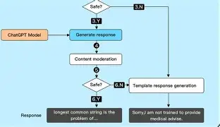

1. What is an API?
An API acts like a waiter between your app and a database, taking requests, retrieving data, and returning responses without exposing internal process.

2. REST API vs SDK
A REST API (Representational State Transfer API) is an architectural style that allows clients and servers to communicate over HTTP using stateless operations on resources, while an SDK is essentially a toolkit for software developers that provides prebuilt components, code libraries, APIs, and documentation to simplify the development process and ensure compatibility with a target platform or operating system

3. What is an API Key?
An API Key is a unique secret string that serves as a digital ID badge to authenticate who is calling the API and track their usage for billing or limits.

4. Why Never Hardcode API Keys?
Hardcoding keys directly into source code makes them vulnerable to automated scrapers on public repositories like GitHub, which leads to stolen credentials and massive unauthorized bills.

5. What are HTTP Methods?
HTTP methods define the action to take: GET retrieves data, POST creates new records, PUT updates existing resources, and DELETE removes them.

6. What is JSON?
JSON is a lightweight, human-readable text format that uses simple key-value pairs and arrays to package data exchanged between clients and servers.

7. What is a Request and Response?
A request is the message sent by a client asking a server to perform an action, while a response is the data or status code the server sends back after processing.

8. Explain 
◦ Endpoint
◦ Headers
◦ Body
◦ Status Codes
An endpoint is the target URL, headers pass extra metadata like authentication, the body contains the main data payload, and status codes (like 200 or 404) report success or failure.

9. What Happens When ChatGPT Receives Your Prompt?
ChatGPT takes your prompt via an HTTP POST request, verifies your access, converts the text into mathematical tokens, runs inference through its neural network, and streams the generated response back to your device.
