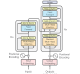

# Inside an LLM: Transformers, Tokens & Context Windows

## 1. Evolution of NLP

**Rule-Based Systems**
Early NLP systems relied on hand-written grammar rules and keyword matching (e.g. "if the sentence contains 'weather', trigger the weather intent"). They were predictable but brittle — they couldn't handle phrasing they weren't explicitly programmed for, and writing rules for every possible sentence structure in a language is practically impossible.

**RNN (Recurrent Neural Network)**
RNNs process text one word at a time, carrying a "hidden state" forward as memory of everything seen so far. This let models learn patterns from data instead of hand-coded rules. The problem: by the time an RNN reaches word 50 in a sentence, the influence of word 1 has mostly faded — this is the *vanishing gradient* problem, and it made RNNs poor at long-range dependencies.

**LSTM (Long Short-Term Memory)**
LSTMs are an upgraded RNN with gates (input, forget, output) that let the network deliberately keep or discard information over longer sequences. This fixed some of the memory-loss problem, but LSTMs still process text **sequentially** — word 2 can't be computed until word 1 is done. This makes them slow to train and still weak on very long-range dependencies.

**Transformer**
Transformers (Vaswani et al., 2017, "Attention Is All You Need") dropped recurrence entirely. Instead of passing information step-by-step, every word can directly "look at" every other word in the sequence at once via **self-attention**. This solved two problems simultaneously: long-range dependencies (any word can attend to any other word regardless of distance) and training speed (computation across positions can be parallelized on GPUs instead of done one step at a time).

### Why Transformers replaced LSTMs
- **Parallelization**: LSTMs must process tokens in order; Transformers process all tokens simultaneously, making them far faster to train on modern hardware.
- **Long-range dependencies**: Self-attention gives every token a direct path to every other token, so meaning doesn't fade over distance the way it does in a sequential RNN/LSTM.
- **Scalability**: Because training parallelizes well, Transformers scale to much larger datasets and parameter counts — which is what enabled the current generation of large language models.

---

## 2. Transformer Architecture

A Transformer has two main halves — an **Encoder** stack and a **Decoder** stack — though many modern LLMs (like GPT) use a decoder-only variant.

- **Encoder**: Reads the entire input sequence and builds a contextual representation of it. Used in tasks like translation (understanding the source sentence) or classification.
- **Decoder**: Generates output one token at a time, using both its own previous outputs and (in encoder-decoder models) the encoder's representation. This is the half responsible for generating text in models like GPT.
- **Embeddings**: Each token (word/subword) is converted into a vector of numbers — a point in high-dimensional space where similar meanings end up closer together.
- **Positional Encoding**: Because self-attention has no built-in sense of word order (it looks at all tokens "at once"), a positional signal is added to each embedding so the model knows token 3 came before token 7.
- **Self-Attention**: The mechanism that lets each token weigh how relevant every other token is to it, and blend their information accordingly (details in Section 3).
- **Feed Forward Network (FFN)**: After attention, each token's representation passes through a small fully-connected neural network (applied identically to every position) that adds non-linear transformation capacity.
- **Multi-Head Attention**: Instead of computing self-attention once, the model computes it several times in parallel ("heads"), each potentially learning a different kind of relationship (e.g. one head tracks grammatical subject-verb links, another tracks coreference like pronouns). The results are combined.
- **Residual Connections**: Each sub-layer's output is added back to its input (`output = Layer(x) + x`) rather than replacing it outright. This helps gradients flow through very deep networks during training and prevents information from being lost layer by layer.
- **Layer Normalization**: Rescales the values flowing through the network at each layer so training stays numerically stable, especially in very deep stacks.

### Transformer Architecture Diagram

---

## 3. Self-Attention

Self-attention lets each token decide how much "attention" to pay to every other token when building its own representation. It works using three learned projections of each token's embedding:

- **Query (Q)**: Represents "what am I looking for?" — the current token's request for relevant context.
- **Key (K)**: Represents "what do I contain?" — a label each token exposes so others can decide if it's relevant to them.
- **Value (V)**: Represents "what information do I actually carry?" — what gets passed along once relevance is decided.

The process: a token's Query is compared against every other token's Key (via dot product) to get a relevance score. These scores are turned into weights (via softmax), and the token's new representation becomes a weighted sum of all tokens' Values, using those weights.

### Example: "The cat sat on the mat because it was tired."

When the model processes the word **"it"**, it generates a Query asking, in effect, "what noun am I referring to?" This Query is compared against the Keys of every other word in the sentence — "The", "cat", "sat", "mat", etc.

- The Key for **"cat"** produces a high relevance score against "it"'s Query, because the model has learned (from massive training data) that pronouns like "it" frequently refer back to a preceding singular noun-phrase, and "tired" is a state far more commonly associated with a living subject like "cat" than an inanimate object like "mat."
- The Key for **"mat"** produces a lower score, since although "mat" is grammatically closer to "it" in the sentence, semantically a mat isn't typically described as "tired."

Because "cat" gets the highest attention weight, its Value contributes most strongly to "it"'s new representation — effectively encoding that "it" = "cat" into the model's understanding of the sentence, without any rule ever explicitly stating "resolve pronouns to the nearest animate noun." This resolution emerges purely from learned patterns in the Query-Key-Value mechanism.

---

## 4. Model Parameters — Comparison

| Model | Approx. Parameter Count | Typical Use Cases | Strengths | Weaknesses |
|---|---|---|---|---|
| **GPT** (OpenAI) | Ranges from a few billion (smaller variants) to reportedly over a trillion in the largest flagship models (exact counts undisclosed for recent versions) | General assistants, coding, complex reasoning, enterprise chat products | Strong general reasoning, wide tool/plugin ecosystem, frequently state-of-the-art on benchmarks | Closed-source (no local weights), usage cost, dependent on API availability |
| **Llama** (Meta) | Open-weight family ranging roughly 1B–405B across versions | Research, fine-tuning, on-premise/local deployment, building custom products | Open weights (can self-host and fine-tune), strong community tooling, no per-token API cost once hosted | Requires significant hardware to run larger variants yourself; smaller variants trail flagship closed models on hard reasoning |
| **DeepSeek** | Open-weight models with large total parameter counts (100B+ range) using a Mixture-of-Experts design, so only a fraction of parameters activate per token | Cost-efficient large-scale reasoning and coding, research on MoE efficiency | Strong performance-per-compute due to MoE (fewer active parameters per forward pass), open weights, competitive on coding/math benchmarks | Full model still large to host even if only part activates per token; ecosystem/tooling newer than GPT/Llama |
| **Qwen** (Alibaba) | Open-weight family ranging roughly 0.5B–100B+ across versions | Multilingual applications (strong Chinese/English performance), general assistants, fine-tuning base | Strong multilingual support, wide range of sizes for different hardware budgets, open weights | Smaller variants weaker on complex reasoning; less dominant mindshare/tooling outside multilingual use cases |

*(Exact parameter counts for the largest closed models like GPT are not publicly confirmed by their vendors; figures above are approximate and based on publicly reported ranges as of early-to-mid 2026.)*

---

## 5. Tokens

- **Character**: The smallest unit of text — a single letter, digit, or symbol (e.g. `c`, `a`, `t`).
- **Word**: A sequence of characters separated by spaces/punctuation, treated as a semantic unit in everyday language (e.g. `cat`).
- **Token**: The unit an LLM actually operates on — often a whole word, but frequently a sub-word chunk, a single character, or even a punctuation mark, depending on the tokenizer. Tokens are the model's real "alphabet."

### Example: how token count varies by sentence

| Sentence | Approx. Characters | Approx. Words | Approx. Tokens (BPE-style) |
|---|---|---|---|
| "I am happy." | 12 | 3 | 4 (`I`, ` am`, ` happy`, `.`) |
| "Antidisestablishmentarianism is rare." | 39 | 3 | ~9 (long/unusual words get split into multiple sub-word tokens) |
| "GPT-4 costs $0.03/1K tokens." | 30 | 5 | ~11 (numbers, punctuation, and `$` symbols often become separate tokens) |
| "The cat sat on the mat." | 25 | 6 | 6 (short, common words often map ~1:1 with tokens) |
| "supercalifragilisticexpialidocious" | 34 | 1 | ~7 (a single long/rare word still gets broken into several tokens) |

**Why token count varies**: Common short words are often a single token, but rare, long, or unusual words (technical jargon, made-up words, non-English text) get broken into multiple sub-word pieces because the tokenizer's vocabulary doesn't contain them as a whole unit. Numbers, punctuation, and symbols also frequently become their own tokens. This is why *word count* and *token count* are never quite the same — token count depends on how "familiar" the text is to the tokenizer's training data.

---

## 6. Tokenization

- **Word Tokenization**: Splits text on whitespace/punctuation into whole words. Simple, but the vocabulary explodes (every inflection like "run", "runs", "running" is a separate entry) and any unseen word becomes an unusable "unknown" token.
- **Character Tokenization**: Splits text into individual characters. Vocabulary stays tiny and nothing is ever "unknown," but sequences become very long (a 10-word sentence might become 50+ character tokens), which is computationally expensive and makes it harder for the model to capture word-level meaning directly.
- **Byte Pair Encoding (BPE)**: Starts from individual characters and iteratively merges the most frequently co-occurring pairs into new sub-word units, building a vocabulary of common word pieces. Frequent words stay whole; rare words get split into meaningful chunks (e.g. "unhappiness" → `un`, `happi`, `ness`).
- **SentencePiece**: A tokenization framework (often paired with BPE or a related "Unigram" algorithm) that treats the input as a raw stream of characters — including spaces — rather than pre-splitting on whitespace first. This makes it language-agnostic, which matters for languages like Chinese or Japanese that don't use spaces between words the way English does.

### Why modern LLMs use BPE or similar approaches
BPE-style sub-word tokenization strikes a practical balance between the two extremes: it keeps the vocabulary size manageable (tens of thousands of tokens, not millions), keeps sequence lengths reasonable (most common words are a single token), and gracefully handles words it's never seen before by falling back to smaller familiar pieces instead of an "unknown" placeholder. This directly improves both training efficiency and the model's ability to generalize to new or rare vocabulary.

---

## 7. Context Window

- **Context Window**: The maximum number of tokens (input + output combined, in most APIs) a model can "see" and reason over at once in a single request. Anything beyond this limit is either rejected or truncated.
- **Input Tokens**: The tokens that make up the prompt/conversation you send to the model.
- **Output Tokens**: The tokens the model generates in its response.
- **Token Limit**: The hard ceiling on input + output tokens for a given model (e.g. 128K, 200K, or 1M tokens depending on the model).
- **Prompt Truncation**: When a conversation exceeds the context window, older content must be cut, summarized, or dropped so the request fits within the limit.

### Why do LLMs sometimes forget earlier parts of a long conversation?
An LLM has no persistent memory between requests — every response is generated fresh from whatever text is inside the current context window. If a conversation grows longer than that window, the earliest messages fall outside what the model can literally see, so they're either dropped entirely or replaced with a summary before being resent. From the model's perspective, content it can't see in its context simply doesn't exist for that request — it isn't "forgetting" in a cognitive sense, it's that the information was never included in the input this time.