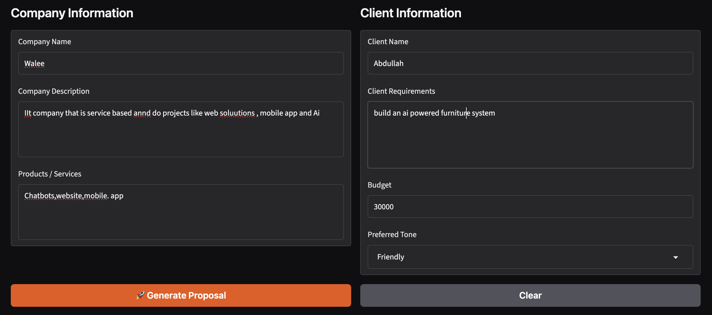

OUTPUT:-
🔎 Client Analysis
Client Analysis
Client Needs

Build an AI-powered furniture system
Pain Points

Lack of advanced AI integration in current furniture systems
Technical complexity in developing AI-driven solutions
Recommended Services

Chatbots
Mobile app
Website
Key Benefits

Enhanced user interaction through AI integration
Streamlined digital platform for furniture solutions
Target Outcomes

Successful deployment of an AI-powered furniture system within budget
🛠 Proposed Solution
To: Abdullah
From: Senior Solutions Architecture Team, Walee
Subject: Proposed Solution: AI-Powered Furniture System

1. Proposed Solution
Hi Abdullah! We are thrilled at the opportunity to partner with you on your new project. To solve the technical complexity of building an advanced, AI-driven furniture system within your $30,000 budget, Walee proposes a comprehensive, multi-channel digital platform.

Our solution integrates an intuitive Website and a Mobile App backed by custom Chatbot technology. This ecosystem will allow your customers to interact with your furniture catalog seamlessly, receive personalized AI recommendations, and visualize furniture solutions in real-time, bridging the gap between traditional retail and modern AI integration.

2. Features
AI-Powered Design Assistant (Chatbot): An intelligent conversational agent that helps users find furniture based on their room dimensions, style preferences, and budget.
Interactive Web Platform: A responsive website featuring a catalog, user accounts, and integrated AI recommendation engines.
Cross-Platform Mobile App: iOS and Android application allowing users to browse, chat with the AI assistant, and manage orders on the go.
Product Recommendation Engine: AI logic that suggests complementary furniture pieces based on user browsing and purchase history.
Admin Dashboard: A centralized backend for your team to manage inventory, update product listings, and review chatbot interaction logs.
3. Implementation Approach
We will utilize an agile development methodology divided into clear, manageable phases to ensure alignment with your vision and budget:

Discovery & Architecture: Finalize user stories, system architecture, and wireframes for the web and mobile interfaces.
Core Development: Build the backend database, core website, and mobile app foundations, alongside training the AI chatbot logic.
AI Integration: Connect the chatbot and recommendation systems to your product catalog.
Testing & Quality Assurance: Conduct rigorous testing across devices for performance, usability, and AI accuracy.
Deployment & Handover: Launch the website and mobile app to production environments and provide staff training.
4. Expected Benefits
Advanced AI Integration: Overcome technical hurdles with Walee’s experienced development team, bringing a cutting-edge furniture system to market.
Enhanced User Interaction: Keep customers engaged longer through interactive AI chat assistants and personalized recommendations.
Streamlined Digital Presence: A unified platform across web and mobile that simplifies the furniture-buying journey for your customers.
Budget-Aligned Delivery: A practical scope designed to maximize feature delivery efficiently within your $30,000 investment.
5. Timeline
Total Estimated Duration: 12 Weeks
Weeks 1–2: Requirements gathering, UI/UX wireframing, and system architecture.
Weeks 3–7: Core web and mobile app development + Chatbot base setup.
Weeks 8–10: AI integration, recommendation engine setup, and system linking.
Weeks 11–12: Quality assurance testing, bug fixing, final deployment, and handover.
6. Deliverables
Fully functional, responsive Website.
Deployed Mobile App (iOS and Android compatible).
Integrated AI Chatbot and recommendation system.
Backend Admin Dashboard for inventory and user management.
Source code ownership and technical documentation upon project completion.
📄 Generated Proposal
Sales Proposal
Executive Summary
Hi Abdullah! We are thrilled at the opportunity to partner with you on your new project. At Walee, we specialize in delivering robust, custom software solutions that bridge complex technical challenges with intuitive user experiences. You are looking to build an innovative, AI-powered furniture system, and our team is fully equipped to bring this vision to life. By combining our expertise in web solutions, mobile applications, and artificial intelligence, we propose a comprehensive digital ecosystem that simplifies technical complexity, integrates advanced AI, and launches smoothly within your specified investment parameters.

Understanding Your Requirements
Through our analysis, we understand that you need to build an advanced, AI-powered furniture system. We recognize the core challenges you are looking to solve:

Advanced AI Integration: Overcoming the lack of native AI capabilities in traditional furniture systems to deliver modern, interactive customer experiences.
Technical Complexity: Navigating the intricate architecture required to connect AI models, recommendation engines, a robust database, and user-facing applications.
Unified Digital Presence: Delivering a seamless experience across multiple touchpoints so your customers can browse, interact, and purchase effortlessly.
Our goal is to tackle these hurdles directly, ensuring a successful deployment of your AI-powered furniture system.

Proposed Solution
To solve the technical complexity of building an advanced, AI-driven furniture system, Walee proposes a comprehensive, multi-channel digital platform.

Our solution integrates an intuitive Website and a cross-platform Mobile App backed by custom Chatbot technology and intelligent recommendation engines. This ecosystem will allow your customers to interact with your furniture catalog seamlessly, receive personalized AI recommendations, and visualize furniture solutions in real-time, bridging the gap between traditional retail and modern AI integration.

Key Features
AI-Powered Design Assistant (Chatbot): An intelligent conversational agent that helps users find furniture based on their room dimensions, style preferences, and budget.
Interactive Web Platform: A responsive website featuring a catalog, user accounts, and integrated AI recommendation engines.
Cross-Platform Mobile App: iOS and Android application allowing users to browse, chat with the AI assistant, and manage orders on the go.
Product Recommendation Engine: AI logic that suggests complementary furniture pieces based on user browsing and purchase history.
Admin Dashboard: A centralized backend for your team to manage inventory, update product listings, and review chatbot interaction logs.
Business Benefits
Overcome Technical Hurdles: Leverage Walee’s experienced development team to navigate complex AI integrations without the friction of trial and error.
Enhanced User Interaction: Keep customers engaged longer through interactive AI chat assistants and personalized product recommendations.
Streamlined Digital Presence: A unified platform across web and mobile that simplifies the furniture-buying journey and expands your market reach.
Budget-Aligned Delivery: A practical, phased scope designed to maximize feature delivery efficiently within your financial parameters.
Implementation Plan
We will utilize an agile development methodology divided into clear, manageable phases to ensure alignment with your vision:

Discovery & Architecture: Finalize user stories, system architecture, and wireframes for the web and mobile interfaces.
Core Development: Build the backend database, core website, and mobile app foundations, alongside training the AI chatbot logic.
AI Integration: Connect the chatbot and recommendation systems to your product catalog.
Testing & Quality Assurance: Conduct rigorous testing across devices for performance, usability, and AI accuracy.
Deployment & Handover: Launch the website and mobile app to production environments and provide staff training.
Timeline
The project will be delivered in an estimated duration of 12 Weeks:

Weeks 1–2: Requirements gathering, UI/UX wireframing, and system architecture.
Weeks 3–7: Core web and mobile app development + Chatbot base setup.
Weeks 8–10: AI integration, recommendation engine setup, and system linking.
Weeks 11–12: Quality assurance testing, bug fixing, final deployment, and handover.
Investment
We have structured our proposal to align directly with your target investment of $30,000. This budget covers the complete end-to-end delivery of the website, mobile app, AI chatbot integration, backend administration dashboard, quality assurance testing, and source code handover.

Why Choose Us?
Walee is a dedicated service-based IT company with a proven track record in delivering high-quality web solutions, mobile applications, and artificial intelligence projects. We understand the nuances of modern software development and combine technical execution with a friendly, collaborative partnership approach. When you work with us, you get a dedicated team committed to your project's success from kickoff to deployment.

Next Steps
Hi Abdullah, we are excited to get started on turning your AI-powered furniture system into a reality. To move forward, let's schedule a brief kickoff call to finalize the project agreement and review the initial discovery phase details. Simply reply to this proposal, and we will get everything set up for you!

