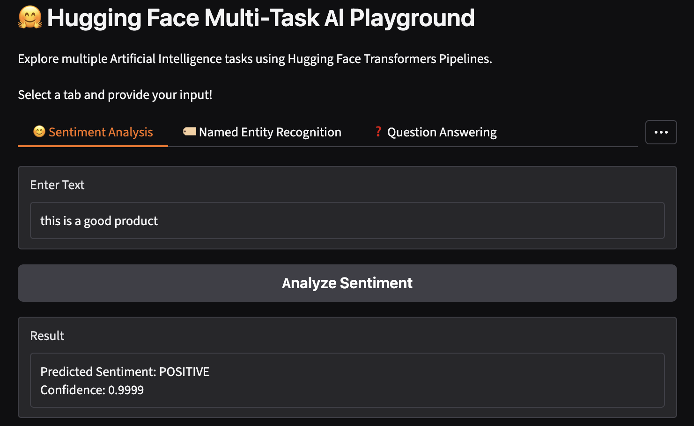
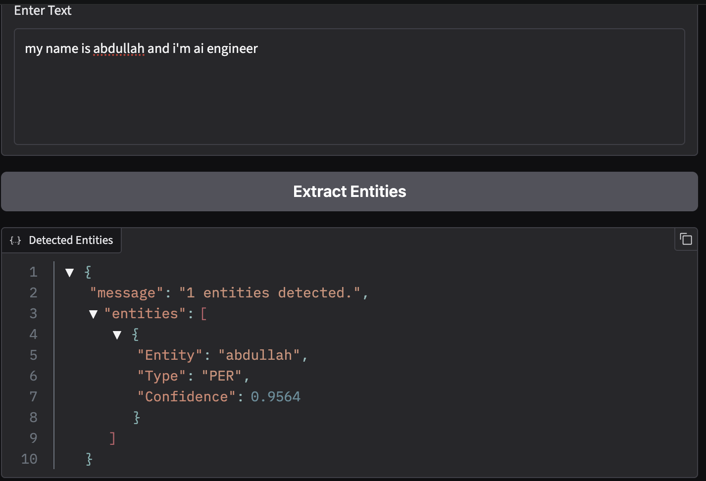
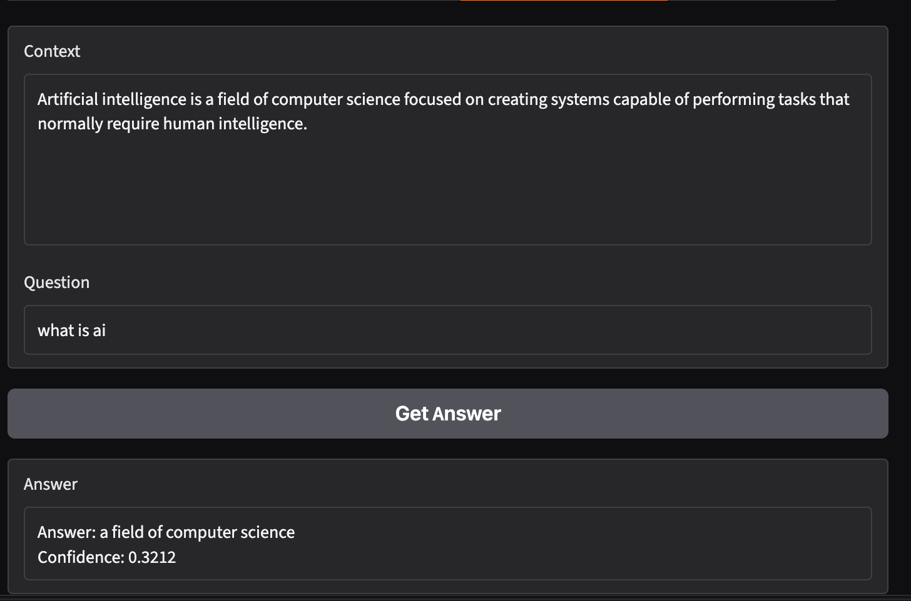
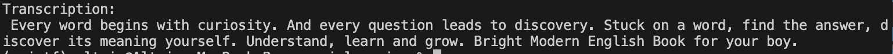
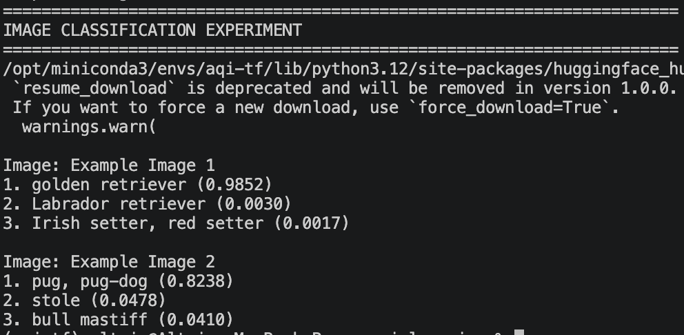

# 🤗 Hugging Face Multi-Task AI Playground

## Overview

This project demonstrates how Hugging Face Transformers Pipelines can be used to quickly build applications for multiple Artificial Intelligence tasks.

## Features

The application supports:

* 😊 Sentiment Analysis
* 🏷️ Named Entity Recognition
* ❓ Question Answering
* ✍️ Text Generation
* 🖼️ Image Classification
* 🎤 Speech to Text

## Installation

Clone or download the project and install the required packages:

```bash
pip install -r requirements.txt
```

## Running Individual Experiments

```bash
python sentiment_analysis.py
python ner.py
python question_answering.py
python text_generation.py
python image_classification.py
python speech_to_text.py
```

## Running the Gradio Application

```bash
python app.py
```

Open the URL displayed in the terminal to access the AI Playground.

## Technologies Used

* Python
* Hugging Face Transformers
* PyTorch
* Gradio
* Pretrained Transformer Models

## Learning Outcomes

This project demonstrates:

* How to use the Hugging Face `pipeline()` API.
* How pretrained models perform inference.
* How different AI tasks require different types of input.
* The limitations of pretrained models.
* How to combine multiple AI models into one application.

## Project Structure

```text
Week3/
└── Day2/
    ├── Week3_Day2_Pipelines.md
    ├── sentiment_analysis.py
    ├── ner.py
    ├── question_answering.py
    ├── text_generation.py
    ├── image_classification.py
    ├── speech_to_text.py
    ├── app.py
    ├── ner_results.md
    ├── Pipeline_Benchmark.md
    ├── requirements.txt
    └── README.md
```

## Important Learning Point

A Hugging Face Pipeline makes pretrained models easy to use, but it does not guarantee that every prediction is correct. Models can be confident and still make mistakes. Therefore, AI systems should always be evaluated using appropriate test data and metrics.

## Outputs:







### Speech to text output


### Image classification
