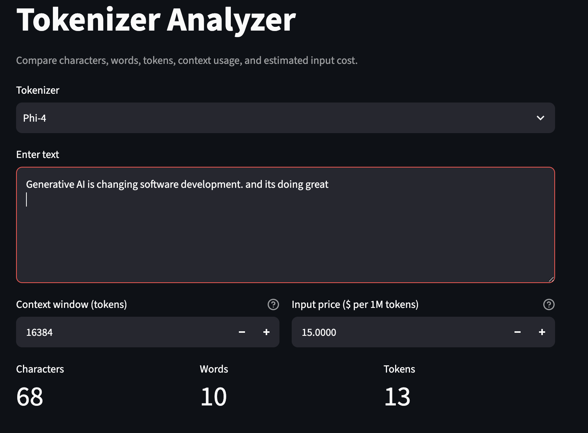
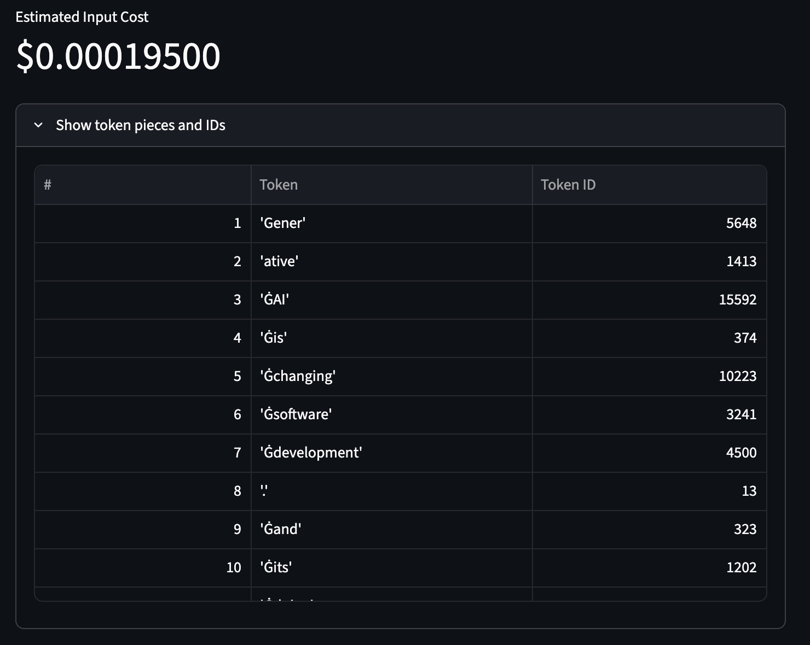

# Week 3 – Day 3
## LLM Tokenizer Explorer & Chat Template Analyzer

This project teaches what happens between human-readable text and the token IDs processed by an LLM.

```text
Human Text
    ↓
Tokenizer
    ↓
Token IDs
    ↓
LLM
    ↓
Token IDs
    ↓
Tokenizer
    ↓
Human Text
```

## Project structure

```text
Week3/
└── Day3/
    ├── tokenizer_explorer.py
    ├── tokenizer_comparison.py
    ├── chat_template_demo.py
    ├── cost_analyzer.py
    ├── Week3_Day3_Tokenizers.md
    ├── tokenizer_comparison.md
    ├── multilingual_analysis.md
    ├── requirements.txt
    └── README.md
```

## 1. Create a virtual environment

### macOS/Linux

```bash
python3 -m venv .venv
source .venv/bin/activate
```

### Windows PowerShell

```powershell
python -m venv .venv
.venv\Scripts\Activate.ps1
```

## 2. Install dependencies

```bash
pip install -r requirements.txt
```

## 3. Hugging Face access

Most tokenizers in this project can be downloaded directly.

For the official Llama 3.1 repository, Hugging Face may require you to:

1. sign in to Hugging Face,
2. accept the model's access/license conditions,
3. authenticate locally.

Install/login command:

```bash
huggingface-cli login
```

You only need tokenizer access. The scripts do not load the full LLM weights.

## 4. Part 2 + Part 3: tokenizer explorer

Default Llama example:

```bash
python tokenizer_explorer.py
```

Choose another tokenizer:

```bash
python tokenizer_explorer.py --tokenizer phi
python tokenizer_explorer.py --tokenizer deepseek
python tokenizer_explorer.py --tokenizer qwen
```

Analyze custom text:

```bash
python tokenizer_explorer.py \
  --tokenizer qwen \
  --text "def calculate_sum(a, b): return a + b"
```

The output includes:

- characters,
- words,
- tokens,
- each token piece,
- token ID,
- encoded ID list,
- decoded text,
- reconstruction check,
- special tokens.

## 5. Part 4: compare tokenizers

```bash
python tokenizer_comparison.py
```

This compares the same text with all four tokenizers and writes:

```text
tokenizer_comparison_results.csv
```

Use the measured values to complete `tokenizer_comparison.md`.

## 6. Part 5 + Part 6: chat template and special tokens

Run:

```bash
python chat_template_demo.py --tokenizer llama
```

or:

```bash
python chat_template_demo.py --tokenizer phi
python chat_template_demo.py --tokenizer deepseek
python chat_template_demo.py --tokenizer qwen
```

It shows:

```text
Messages
   ↓
Chat Template
   ↓
Special/Role Markers
   ↓
Token IDs
```

Study the rendered prompt carefully. Different model families can serialize the same role/message objects differently.

### Important question

**What could happen if we use the wrong chat template with a model?**

Possible consequences include:

- system instructions treated as ordinary text,
- incorrect role boundaries,
- assistant/user turns confused,
- generation starting at the wrong location,
- stop tokens handled incorrectly,
- degraded instruction-following,
- raw control markers appearing in output.

## 7. Part 7: launch the cost analyzer

```bash
streamlit run cost_analyzer.py
```

Features:

- choose tokenizer,
- enter text,
- character count,
- word count,
- token count,
- editable context-window size,
- estimated context usage,
- editable input price per million tokens,
- estimated input cost,
- token-piece/ID inspection.

Output:


### Why are context and price editable?

Provider pricing and deployed context limits can change and can differ between variants/endpoints.

The educational tool therefore calculates from values the user supplies rather than pretending hard-coded prices are permanently correct.

## 8. Part 8: multilingual experiment

Open:

```text
multilingual_analysis.md
```

Run the included experiment for:

- English,
- Urdu,
- Arabic,
- Chinese.

Record the measured token counts and discuss why tokenization efficiency differs.

## 9. Suggested demonstration order

For a classroom/intern demonstration:

```text
1. tokenizer_explorer.py
2. tokenizer_comparison.py
3. chat_template_demo.py
4. cost_analyzer.py
5. multilingual_analysis.md
```

## 10. Learning outcomes

After completing the project, the intern should be able to explain:

- what tokenization is,
- encoding versus decoding,
- token IDs,
- BOS/EOS/PAD/UNK,
- tokenizer-specific segmentation,
- why token counts differ across models,
- context-window consequences,
- token-based cost,
- multilingual tokenization behavior,
- chat templates,
- why using the model's correct chat template matters.

## Important rule

Do **not** replace a pretrained model's tokenizer with whichever tokenizer gives the lowest token count.

The model's vocabulary IDs and learned embeddings are coupled to the tokenizer used during training.
